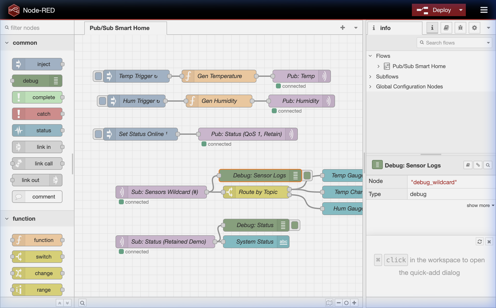
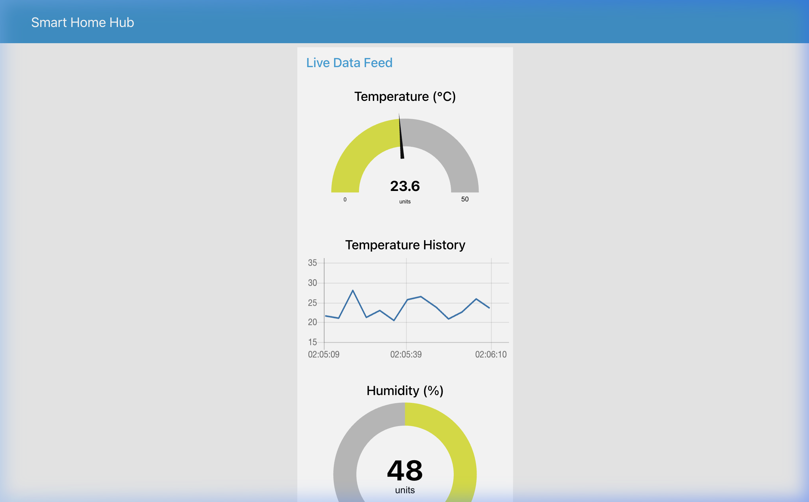

# Smart Home MQTT Publish-Subscribe System

This repository demonstrates a complete Publish/Subscribe architectural pattern built using Node-RED and MQTT, fulfilling the core assignment requirements for demonstrating QoS, Wildcards, and Live Data Dashboards.

## Overview
The project models a **Smart Home Sensor Network**. It simulates edge devices capturing environmental data and routing it through a central MQTT message broker.

- **Broker:** Public HiveMQ MQTT Broker (`broker.hivemq.com:1883`)
- **Publishers:** Simulated Temperature and Humidity sensors, and a Status setter.
- **Subscribers:** Wildcard listener integrating multiple topics, and a direct status listener.
- **Dashboard:** Node-RED UI dashboard for visualizing the live IoT metrics.

---

## 1. Node-RED Flow Design

The Node-RED flow consists of the following components:
1. **Temperature Publisher:** Triggers every 5s, generates a temp (20-30°C), and publishes to `smarthome/sensors/temperature` (QoS: 0).
2. **Humidity Publisher:** Triggers every 7s, generates humidity (40-60%), and publishes to `smarthome/sensors/humidity` (QoS: 0).
3. **Status Publisher:** A manual trigger that publishes "Online" to `smarthome/status` with **QoS: 1** and **Retained Message: True**.
4. **Wildcard Subscriber:** Reads from `smarthome/sensors/#`, capturing both temperature and humidity messages. A Node-RED `switch` node dynamically routes them to the correct dashboard Gauge/Chart.
5. **Status Subscriber:** Reads from `smarthome/status` showing how a new subscriber immediately receives the retained message upon connecting.

### Final Node-RED Flow Screenshot



---

## 2. Message Broker Logs

The following live message log demonstrates the active Pub/Sub topics. Notice the QoS levels and the Retain flags in action.

```
[02:07:04] TOPIC: smarthome/status | QoS: 1 | RETAIN: True | PAYLOAD: Online
[02:07:04] TOPIC: smarthome/sensors/temperature | QoS: 0 | RETAIN: False | PAYLOAD: 27.7
[02:07:09] TOPIC: smarthome/sensors/temperature | QoS: 0 | RETAIN: False | PAYLOAD: 23.4
[02:07:10] TOPIC: smarthome/sensors/humidity | QoS: 0 | RETAIN: False | PAYLOAD: 41
[02:07:14] TOPIC: smarthome/sensors/temperature | QoS: 0 | RETAIN: False | PAYLOAD: 29.3
[02:07:17] TOPIC: smarthome/sensors/humidity | QoS: 0 | RETAIN: False | PAYLOAD: 44
[02:07:19] TOPIC: smarthome/sensors/temperature | QoS: 0 | RETAIN: False | PAYLOAD: 24.7
```

---

## 3. Live Data Dashboard

The UI groups the real-time sensor streams into visually accessible metrics using Node-RED Dashboard components.



---

## 4. Video Demonstration Guide & Script

*(Note: Use this script conceptually during your video recording)*

**1. Pub/Sub Roles:**
> "In this flow, the inject and function nodes act as the **Publishers**, simulating our smart home sensors. They continuously send payload data to the HiveMQ broker under specific topics. The MQTT-In nodes acting as **Subscribers** listen for these topics and push the incoming data sequentially to the UI components on the dashboard."

**2. How Wildcards Work:**
> "To avoid creating a separate subscriber node for every single sensor in the house, I'm using the MQTT wildcard character `#`. By subscribing to `smarthome/sensors/#`, the broker automatically forwards messages from `smarthome/sensors/temperature` and `smarthome/sensors/humidity` through a single pipe, which I then categorize using a Switch node."

**3. QoS and Retained Messages:**
> "For my sensors, I use **QoS 0** (At most once) because occasional packet drops in sensor readings aren't critical. However, my Status topic uses **QoS 1** (At least once) to ensure delivery. I also set the Status message block to **Retain: True**. This means if a new Node-RED client subscribes to the status topic *after* the status was published, the broker instantly delivers the last known retained state—demonstrating real-time state synchronization."

---
*Generated for VTOP Assignment Deliverables.*
